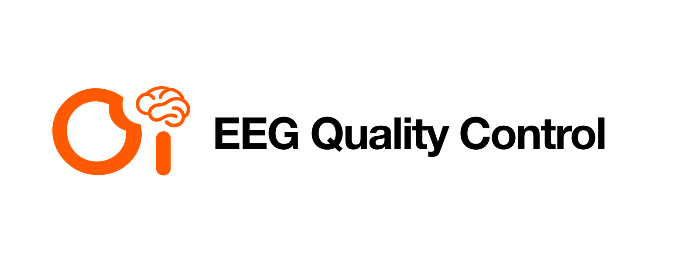

<h1 align="center">oi-eegqc</h1>

<p align="center">
  <a href="README.zh-CN.md">简体中文</a> · <strong>English</strong>
</p>

<p align="center">
  <strong>Adaptive EEG quality control for clean commercial acquisition.</strong><br>
  Grade multi-duration, multi-montage clips for intake — not for task performance.
</p>

<p align="center">
  
  
  
  
</p>

<p align="center">
  <a href="#quick-start"><strong>Install</strong></a> ·
  <a href="#what-it-does">What it does</a> ·
  <a href="#design-principles">Principles</a> ·
  <a href="#grade-tracks">Grade tracks</a> ·
  <a href="#machine-protocol">Machine protocol</a> ·
  <a href="docs/windows-app.md">Windows app</a> ·
  <a href="#threshold-calibration">Calibration</a> ·
  <a href="#configuration">Config</a>
</p>

<p align="center">
  
</p>

`oi-eegqc` is the intake bench for audiovisual-watching EEG that arrives **protocol-clean**: known montage, known sampling rate, known clip timing, and event streams you trust enough to score.

It answers one question only:

> **Is this recording acceptable as data?**

It does **not** answer whether the subject passed ASSR, N-back, caption decoding, or any downstream model eval. Harder tasks produce noisier scientific outcomes; that variance must never become a quality penalty.

## Quick Start

```bash
pip install -e ".[dev]"
oi-eegqc demo --channels 32 --duration 12
```

Score one continuous clip:

```bash
oi-eegqc eval-npy \
  -i clip.npy \
  --sfreq 250 \
  --unit uV \
  --ch-names ch_names.npy \
  -o report.json
```

Batch a folder:

```bash
oi-eegqc eval-dir -i ./clips --sfreq 250 --unit uV -o batch_report.json
```

Python API:

```python
from oi_eegqc import RecordingInput, evaluate_recording
import numpy as np

data = np.load("clip.npy")  # (n_channels, n_times)
report = evaluate_recording(
    RecordingInput(
        data=data,
        sfreq=250.0,
        ch_names=[f"E{i}" for i in range(data.shape[0])],
        unit="uV",                  # or "V" / "mV" / "adc" + adc_to_uv
        clip_id="vid_001",
        expected_n_channels=64,
        stimulus_duration_s=18.0,
        event_ok=True,
        sync_error_ms=8.0,
    )
)
print(report.letter_grade, report.gqi, report.availability)
```

Registered dataset adapters all yield `RecordingInput` — they never score:

```bash
oi-eegqc datasets
oi-eegqc eval-bdf -i recording.bdf --unit V -o report.json   # needs oi-eegqc[mne]
oi-eegqc bench hw --root ./sessions -o hw.json
oi-eegqc bench nod --root ./epochs_uV --subjects sub-01 sub-02
oi-eegqc bench synthetic --channels 32 --duration 20
```

```python
from oi_eegqc import load_npy, load_edf_bdf, open_dataset, score_adapter

rec = load_npy("clip.npy", sfreq=250.0, unit="uV")
adapter = open_dataset("hw", "./sessions")          # or "nod" / "npy" / "synthetic"
rows, summary = score_adapter(adapter)              # extras only; no flattened fields
```

Machine-readable stdout (for scripts or a desktop sidecar):

```bash
oi-eegqc --json datasets
oi-eegqc --ndjson bench synthetic --channels 32 --duration 12
oi-eegqc serve --stdio
```

| Adapter | Input | Notes |
| --- | --- | --- |
| `npy` | directory of 2D `.npy` clips | `--sfreq` and `--unit` required |
| `hw` | session folders (`session.json` + BDF) | Neuracle volts / TD10 ADC counts |
| `nod` | `{subject}_epochs_uV.npy` | physical µV; valid QC reference |
| `things` | THINGS-EEG2 preprocessed arrays | unitless; not comparable, opt-in |
| `synthetic` | in-memory | clean / noisy / dead / saturated |

### Units are part of the contract

`unit` is not cosmetic. Saturation and dead-channel gates compare against
physical microvolt thresholds, so a mis-declared unit silently disables them.
Pass `"V"` for MNE-loaded EDF/BDF (MNE rescales microvolt headers into SI
volts), or `"adc"` with `adc_to_uv` for raw headset counts. Unknown units raise
rather than defaulting.

Data that has been noise-normalised or whitened (for example the published
THINGS-EEG2 arrays, whose values have unit standard deviation) has no physical
scale, and the absolute gates cannot be applied to it at all.

## What It Does

| Workflow | Result |
| --- | --- |
| Duration-adaptive QA | Picks window/hop and ODQ cutoffs for ~5–60s+ clips |
| Montage-adaptive QA | Adjusts correlation / bad-channel / amplitude tolerances for 4ch → 128ch+ |
| Absolute amplitude gates | Rail clipping, saturation and dead/detached leads in microvolts |
| Relative outlier detection | Per-channel temporal and cross-channel spatial robust-z |
| Spectral QA | Broadband HF noise-to-signal and mains-band interference, kept as continuous measures |
| Spatial coupling | Top-3 neighbour correlation, auto-disabled on montages too sparse to be diagnostic |
| Letter grading | WeBrain-style **A / B / C / D** on usable recording time |
| Decomposable GQI | **0–100** over contact · cleanliness · usable time · integrity · stimulus sync |
| Hard-fail gates | Broken markers, railed amplifier or missing montage reject outright |
| Availability flag | HBN-style **Available / Caution / Unavailable**, derived from the letter |
| Versioned thresholds | Every score carries `threshold_version` for auditability |

### Two quality numbers that are not the same thing

`clean_ratio` and `usable_ratio` answer different questions and are reported
separately:

- **`clean_ratio`** is a *density* over channel × window cells: how much of the
  recorded surface is contaminated.
- **`usable_ratio`** (× 100 = **ODQ**) is a *time* measure: the share of windows
  where at most `max_bad_ch_frac_per_window` of channels are bad, i.e. how many
  seconds survive. This matches the quantity WeBrain's A/B/C/D cutoffs were
  defined against.

Ten percent bad channels in every window gives `clean_ratio` 0.90 with ODQ 100;
ten percent of windows destroyed outright gives `clean_ratio` 0.90 with ODQ 90.
Collapsing them into one number would double-count it across two GQI weights.

## Design Principles

- **QC ≠ task eval.** Intake grades measure signal and acquisition integrity. Downstream scientific or model metrics live elsewhere.
- **Assume pure intake.** Events, montage, units, and clip boundaries are part of the protocol — not recovered archaeology.
- **Adapt, don’t hard-code one window.** A 6s clip and a 60s clip need different statistics.
- **Adapt, don’t hard-code one montage.** Low-density arrays must not inherit high-density correlation thresholds.
- **QA then QC.** Continuous metrics first; letter / GQI / availability are criterion layers on top.
- **One canonical report body.** `report.to_dict()` is the machine-readable contract; HTML dashboards are derived views.
- **Never score cognition.** Band ratios, “focus”, “engagement”, or difficulty-dependent ERPs are out of scope for acceptance.
- **Never launder the denominator.** Dead and flat channels stay in the montage and are penalised. Silently dropping them lets a recording with a quarter of its electrodes detached report a perfect score.
- **No free credit for untested dimensions.** GQI is a weighted average over the dimensions that actually had inputs, and the weights of the rest are redistributed. Omitting sync metadata cannot earn sync points.
- **Calibrate against injected faults, never against a convenient dataset.** Lowering a threshold until real data passes is circular and destroys sensitivity to the fault the threshold exists to catch.

## Grade Tracks

| Track | Scale | Use |
| --- | --- | --- |
| Letter | A / B / C / D | **Authoritative.** Settlement, re-record, release gates |
| GQI | 0–100 + dimension breakdown | Ranking, dashboards, continuous monitoring |
| Availability | Available / Caution / Unavailable | Dataset filters and catalog flags |

The letter grade is the contractual decision and the availability flag is
derived from it, so the two cannot disagree: **D is always Unavailable**, and a
hard fail is always both. GQI never overrides the letter; it ranks recordings
*within* a tier.

Suggested commercial reading:

| Letter | Meaning | Typical action |
| --- | --- | --- |
| **A** | Clean enough to ship | Primary training / delivery |
| **B** | Good with mild defects | Keep; light cleaning OK |
| **C** | Marginal | Down-weight or human review |
| **D** | Bad | Reject / re-acquire |

Letter grades move in steps by design, because they are tier decisions. GQI is
the continuous track: a degradation that pushes every window past the
bad-channel budget at once will drop the letter sharply while GQI declines
smoothly, since it blends flag density with continuous spectral measures.

## Machine protocol

Human CLI output is for terminals. A Windows Electron app should not scrape it.
Use `--json` / `--ndjson`, or spawn `oi-eegqc serve --stdio` as a sidecar and
speak NDJSON on stdin/stdout.

Two version strings stay distinct:

| Field | Example | When it changes |
| --- | --- | --- |
| `schema_version` on the envelope | `oi-eegqc-protocol-v1` | Envelope keys (`ok`, `event`, `kind`) |
| `schema_version` on a report | `oi-eegqc-report-v1` | Fields inside `QualityReport.to_dict()` |
| `threshold_version` | `oi-eegqc-v0.2.0` | Scoring cutoffs (orthogonal to the wire format) |

Stdout in machine mode is JSON only. Warnings and human progress go to stderr.
`--json` / `--ndjson` require an explicit `--root` for on-disk datasets — the
workstation defaults are never used silently.

```bash
oi-eegqc --json datasets
oi-eegqc --ndjson bench synthetic --channels 32 --duration 12
```

```text
{"ok":true,"schema_version":"oi-eegqc-protocol-v1","kind":"batch","event":"progress","done":1,"total":4,"clip_id":"synthetic_clean","letter_grade":"A","gqi":98.2}
{"ok":true,"schema_version":"oi-eegqc-protocol-v1","kind":"batch","event":"done","reports":[...],"summary":{...},"cancelled":false}
```

Sidecar ops: `ping`, `list_datasets`, `score_file`, `score_dataset`, `cancel`,
`shutdown`. A `cancel` line interrupts the in-flight batch *between* recordings;
the current `evaluate_recording` call still finishes, and already-scored rows
are kept with `cancelled: true`. Errors are `{ok:false, code, message}` —
switch on `code` (`unknown_dataset`, `missing_root`, `missing_sfreq`,
`mne_required`, `file_not_found`, `unknown_unit`, `invalid_request`,
`unknown_op`, `eval_failed`). Dataset provenance lives in `report.extras` only;
bench fields are not flattened onto the report body.

```json
{"id":"1","op":"score_dataset","dataset":"synthetic","n_channels":32}
{"id":"1","event":"progress","done":3,"total":4,"clip_id":"synthetic_dead_quarter"}
{"id":"1","event":"done","kind":"batch","summary":{"n_total":4,"cancelled":false},"reports":[]}
```

`score_adapter(..., on_progress=..., cancel=...)` is the same contract the
sidecar uses. Prefer calling those Python functions from the sidecar over
parsing human CLI text.

The Windows intake shell is a native viewer, not Electron — see
[docs/windows-app.md](docs/windows-app.md).

## Pipeline (v0.2)

1. Drop aux channels only — flat and dead channels stay in the denominator
2. Convert the declared `unit` into microvolts
3. Detect rail clipping on the **unfiltered**, DC-centred signal
4. Zero-phase Butterworth high-pass (>1 Hz)
5. Select **duration profile** + **montage profile**
6. Window QA → `clean_ratio` (cell density) and `usable_ratio`/ODQ (surviving time)
7. Hard-fail gates: broken markers, railed amplifier, missing montage
8. Letter from ODQ, then capped by the bad-channel ceiling
9. GQI as a weighted average over assessed dimensions only
10. Availability flag derived from the letter

## Threshold Calibration

Thresholds are derived from injected faults with known severity, not tuned
until a dataset passes:

```bash
python examples/calibrate_thresholds.py
```

Seven degradation models are swept across severity grids and checked for three
properties — monotonic decline (Spearman ρ ≤ −0.9), a graded rather than
step-like response, and detection at the severity where failure is expected.
The script exits non-zero if any check fails, so it belongs in CI before a
`threshold_version` bump.

| Scenario | Property required | Rationale |
| --- | --- | --- |
| Broadband noise | Graded | Sensor and EMI noise vary continuously |
| Dead channels | Graded | Electrodes detach one at a time |
| Detached channels | Graded | Normal amplitude, no shared signal — only the coupling detector can see it |
| Movement bursts | Graded | Time lost to artifact varies continuously |
| Mains interference | Graded | Amplitude varies; mild mains is notch-removable and keeps grade A |
| Saturation | Binary rejection | An amplifier either rails or it does not; a smooth ramp would be fiction |
| Slow drift | No effect | The 1 Hz high-pass must absorb it; guards against filter regressions |

Two thresholds worth noting, both set from measured separation rather than
intuition:

- **Spatial coupling.** Detached electrodes score 0.09–0.17 on the top-3 |corr|
  statistic, while intact recordings sit at 0.69 (NOD-EEG 5th percentile) and
  0.71 (Neuracle). The 0.40 cutoff sits in that gap. On a 4-channel headset the
  *intact* channels score 0.13–0.31, overlapping the detached range, so the
  detector has no discriminative power there and is switched off for
  `low_density` instead of being given an arbitrary threshold.
- **Mains.** A cell is flagged only once mains power rivals the entire 1–45 Hz
  band. Milder interference lowers the cleanliness score without disqualifying
  the recording.

## Configuration

Write a starting YAML:

```bash
oi-eegqc init-config -o my_qc.yaml
```

Or edit [`configs/default.yaml`](configs/default.yaml). Bump `threshold_version` whenever cutoffs change so historical grades stay comparable.

## How It Is Organized

```text
.
├── assets/                 # hero + wordmark
├── configs/default.yaml    # duration + montage profiles
├── docs/windows-app.md     # minimal native Windows QC shell
├── examples/
│   ├── sidecar_session.py            # stdio sidecar client (Windows should mirror this)
│   ├── calibrate_thresholds.py       # injected-fault threshold calibration
│   ├── run_hw_bdf_bench.py           # Neuracle / TD10 BDF sessions
│   └── run_public_dataset_bench.py   # NOD-EEG (THINGS opt-in)
├── src/oi_eegqc/
│   ├── io/                 # npy / EDF / BDF / clips / reports
│   ├── datasets/           # npy, hw, nod, things, synthetic adapters
│   ├── protocol.py         # envelope + structured errors
│   ├── serve.py            # NDJSON stdio sidecar
│   ├── adapters.py         # channel pick, clipping, high-pass, windows
│   ├── config.py           # adaptive profiles + thresholds
│   ├── qa/windows.py       # window detectors → clean_ratio + ODQ
│   ├── scoring/grades.py   # letter / GQI / availability / hard fails
│   ├── pipeline.py         # evaluate_recording
│   └── cli.py              # oi-eegqc entrypoint
└── tests/
```

## Requirements

- Python 3.9+
- `numpy`, `scipy`, `pyyaml`
- Optional: `mne` for EDF/BDF (`pip install -e ".[mne]"`)

## References

- [PREP pipeline](https://doi.org/10.3389/fninf.2015.00016) — early-stage noisy-channel / referencing discipline  
- [Autoreject](https://doi.org/10.1016/j.neuroimage.2017.06.030) — adaptive trial rejection mindset  
- [WeBrain quantitative EEG QA](https://doi.org/10.1088/1361-6579/ac890d) — ODQ → A/B/C/D  
- [HBCD EEG QC](https://doi.org/10.1016/j.dcn.2024.101447) — intake gates and dashboards  
- HBN-EEG availability flags · MEEGqc GQI · IFCN/ILAE impedance guidance  

## Status

Research/engineering bench for OI audiovisual EEG intake. Thresholds must be
calibrated on your device and pilot batches before production settlement — run
`examples/calibrate_thresholds.py` after any change.

### v0.2 — scoring rework

`threshold_version` moved to `oi-eegqc-v0.2.0`; v0.1 scores are **not**
comparable. Fixed in this release:

- `usable_ratio` was algebraically identical to `ODQ/100`, so one quantity
  carried 60% of GQI across two weights. ODQ is now the WeBrain-style surviving
  window share and `clean_ratio` the separate cell-density measure.
- Every metric was scale-invariant, so 0.05 µV and 53 000 µV both graded A.
  Units are now declared and absolute amplitude gates apply.
- Zero-variance channels were dropped before scoring, so 8 of 32 dead
  electrodes yielded grade A with an empty reason list. They now stay in and
  are penalised.
- Amplitude outliers used a cross-channel MAD, which breaks down at 50%
  contamination; half a montage attenuated scored a perfect ODQ. Detection is
  now per-channel over time, with the cross-channel test restricted to the high
  side and to montages of at least 8 channels.
- GQI bottomed out at 26/100 for unusable data because untested dimensions
  granted their weight for free. Weights are now redistributed across assessed
  dimensions and GQI reaches 0.
- Every D-grade clip reported `Caution`. Availability is now derived from the
  letter, so D is always `Unavailable`.
- The signal band `(1, 50)` and noise band `(50, 100)` both included the mains
  frequency, counting it as signal and noise at once. They are now `(1, 45)`
  and `(55, 95)` with a dedicated mains detector.
- Duration and sync integrity were never exercised: benches passed each clip's
  own length as its stimulus duration and hard-coded a passing sync error. The
  Huawei bench now checks sample count against wall-clock time and leaves
  uncalibrated sync unassessed.

### v0.3 — machine protocol

Package version `0.3.0`. Scoring and `threshold_version` are unchanged
(`oi-eegqc-v0.2.0`). This release is the Electron seam:

- Protocol envelope (`oi-eegqc-protocol-v1`) separate from the report body
  (`oi-eegqc-report-v1`).
- `--json` / `--ndjson` / `--quiet`; human text on stderr in machine mode.
- `oi-eegqc serve --stdio` with cancellable `score_dataset`.
- Dataset fields stay in `extras`; they are no longer flattened onto reports.

## License

[MIT](LICENSE)
